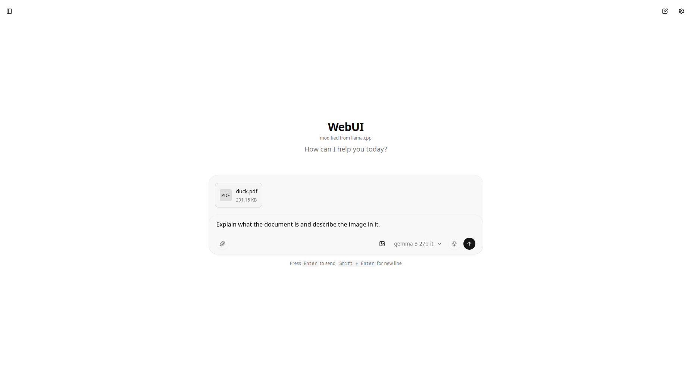
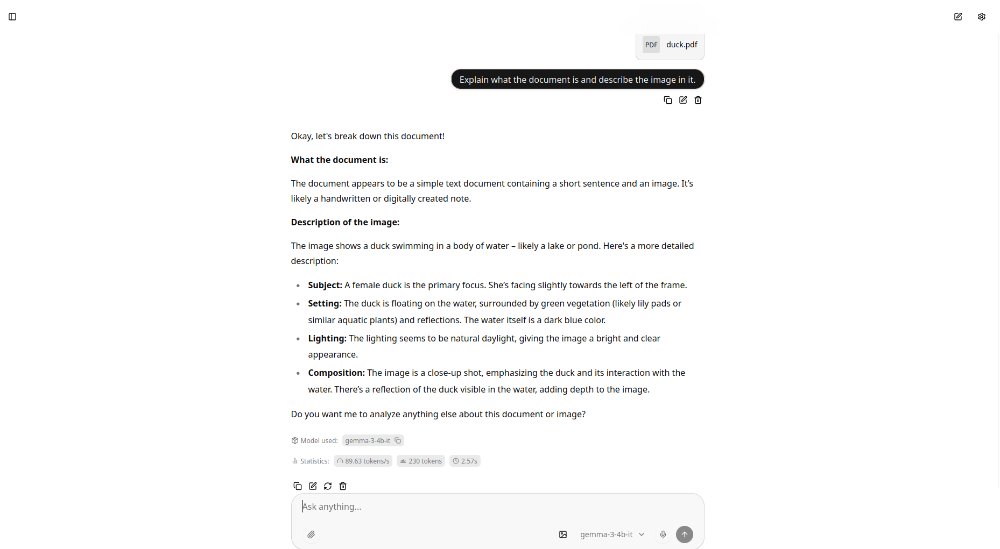
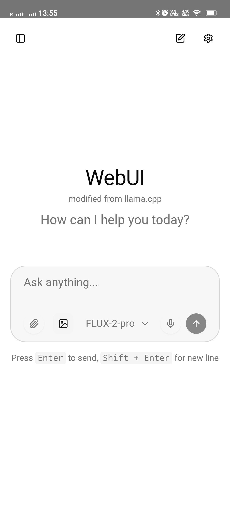
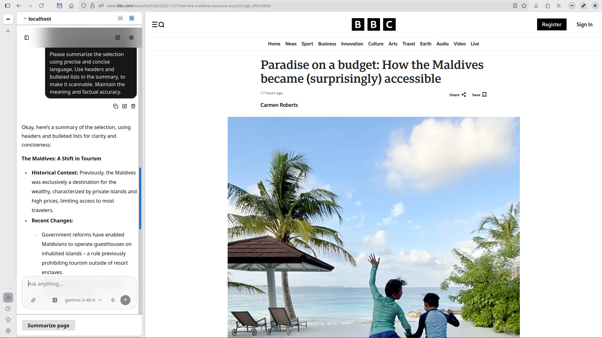

# Standalone llama.cpp WebUI

Modified from llama.cpp

All credit goes to the llama.cpp team and contributors.

## Purpose

This is a standalone web interface designed to work with OpenAI-compatible APIs. It can be used with llama-server and other providers that support the OpenAI API format.

## Features

- OpenAI API compatibility
- Works with llama-server
- Supports multiple LLM providers
- Conversation management and branching
- File attachments (images, PDFs, audio, text)
- Available as Android APK

## Screenshots


*Web View and read pdf as images*


*Web View and read pdf as images - response*


*Mobile interface view*


*AI image generation feature*


*Compitable with AI chatbots in Firefox*

## Platform Support

Available for web browsers and as an Android application (APK).

## Getting Started

### Web Version

1. Install dependencies:
```bash
npm install
```

2. Run the development server:
```bash
npm run dev
```

3. Build for production:
```bash
npm run build
```

### Android Version

See [ANDROID_BUILD.md](ANDROID_BUILD.md) for detailed instructions on building the Android APK.

Quick commands:
```bash
npm run cap:sync    # Build and sync to Android
npm run cap:open    # Open in Android Studio
npm run cap:run     # Build, sync, and run on device
```

## Firefox AI Chatbots Integration

This application can be integrated with Firefox's built-in AI Chatbots feature. We use **port 8000** instead of the default 8080 to avoid Firefox's limitations.

### Why Port 8000?

Firefox has a fixed maximum length limit of **8192 characters** when using `localhost:8080`. By using a different port, you can bypass this limitation.

### Setup Instructions

1. Start the development server, will automatically open port 8000:
```bash
npm run dev
```

2. Configure Firefox by going to `about:config` and setting:
   - `browser.ml.chat.hideLocalhost` = `false` (required to use localhost in AI chatbots)
   - `browser.ml.chat.provider` = `http://localhost:8000`
   - `browser.ml.chat.maxLength` = `1000000`

With this configuration, the "Summarize Page" command and other AI features will no longer be limited by the 8192 character restriction.

## Configuration

Configure your API endpoint in the app settings:
- API Base URL: Your OpenAI-compatible endpoint
- API Key: Your authentication key
- Model: Your model identifier

## Credits

This project is based on and modified from llama.cpp. All credit goes to the original llama.cpp team and contributors.

## License

This project follows the same license as llama.cpp.
