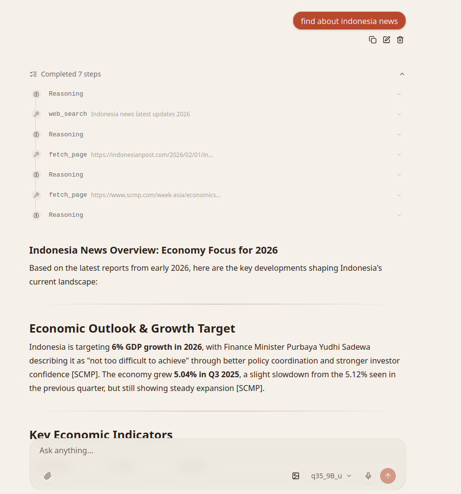
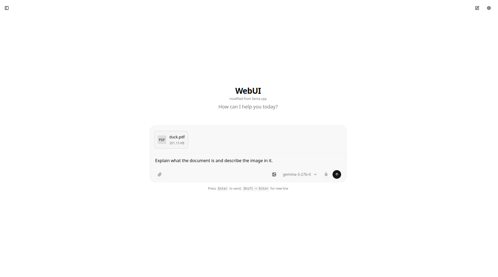
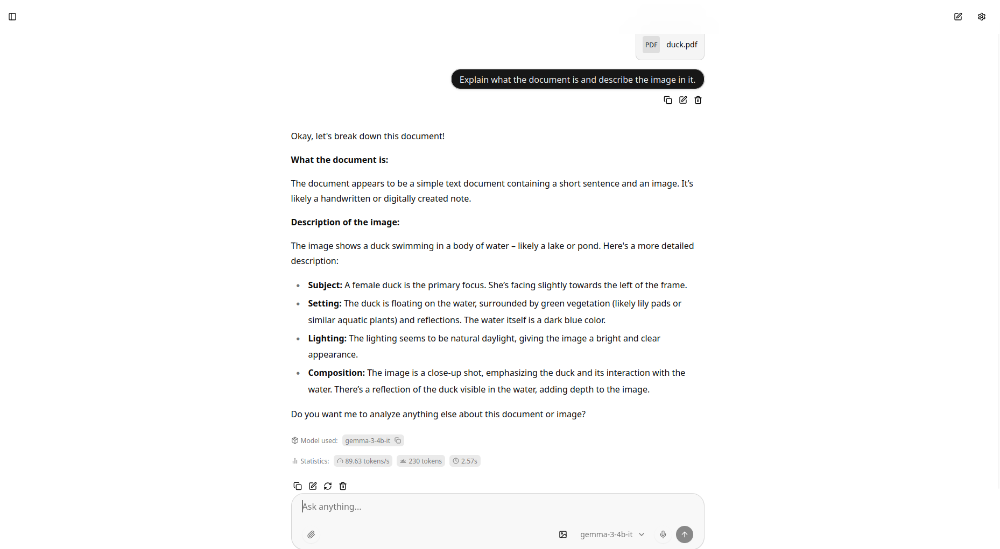
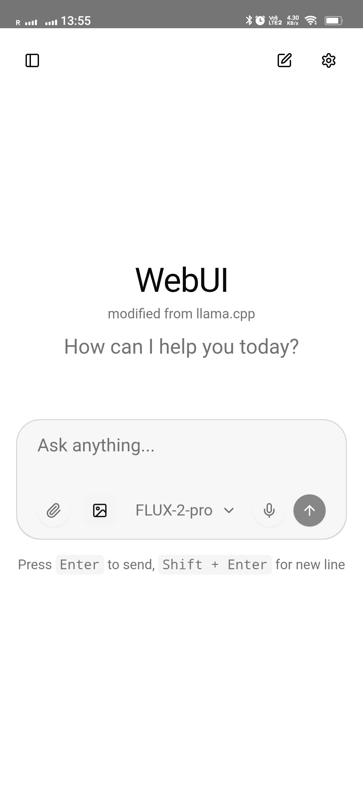
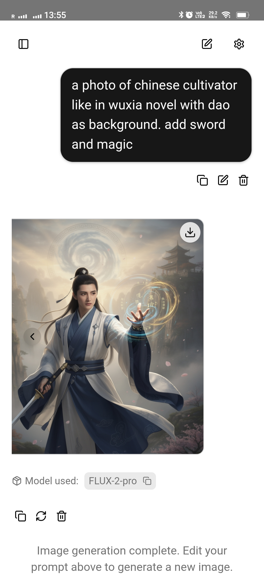
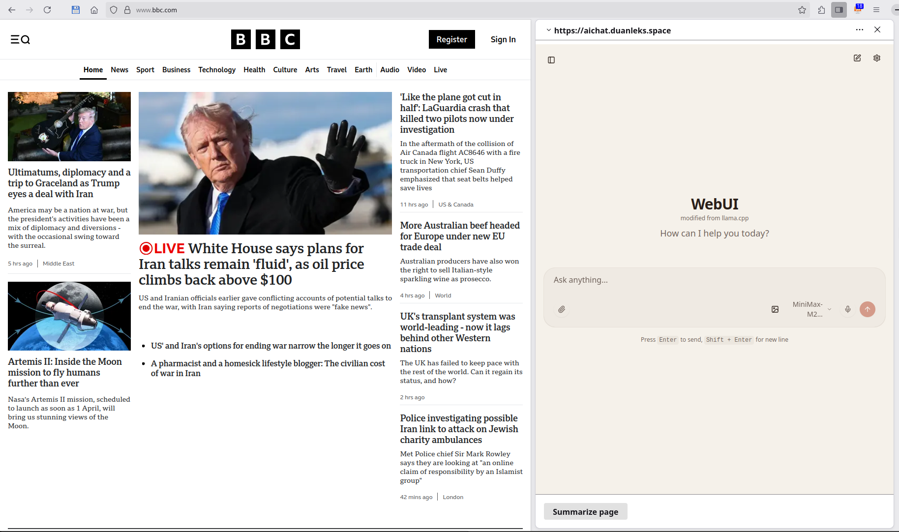

# Standalone llama.cpp WebUI

Modified from llama.cpp

All credit goes to the llama.cpp team and contributors.

**Live Demo:** https://aichat.duanleks.space/

<details>
<summary><strong>Live Demo: All data (API keys, chat history, parameters) is stored in your browser only - safe client-side storage, no server storage.</strong></summary>

### Data Storage & Privacy

When using the live demo (or any deployed version), all your data is stored **locally in your browser**:

- **API Keys**: Stored in your browser's localStorage
- **Chat History**: Stored in your browser's IndexedDB database
- **Settings & Parameters**: Stored in your browser's localStorage

**Important:**
- ✅ **No server storage**: Your data never reaches any server
- ✅ **Client-side only**: Everything stays on your device
- ✅ **Privacy**: Each user's data is isolated to their own browser
- ⚠️ **Browser access**: Anyone with access to your browser can view this data
- ⚠️ **Device-specific**: Data doesn't sync across devices

This is a static web application with no backend. All processing happens in your browser.

</details>

## Purpose

This is a standalone web interface designed to work with OpenAI-compatible APIs. It can be used with llama-server and other providers that support the OpenAI API format.

## Features

- OpenAI API compatibility
- Works with llama-server
- Supports multiple LLM providers (Vultr, DeepInfra, OpenRouter, etc.)
- Conversation management and branching
- File attachments (images, PDFs, audio, text)
- **MCP (Model Context Protocol) integration** — connect to MCP servers for tool calling (with API key/header auth support)
- **Agentic tool execution loop** — models can call tools, get results, retry on errors, and call more tools (configurable max turns)
- **Perplexity-style collapsed steps** — agentic steps (reasoning, tool calls) are collapsed into a single "Completed N steps" dropdown
- **Built-in tools** — calculator and date math work without any MCP server
- **Reasoning model support** — collapsible `<think>` blocks for DeepSeek-R1, QwQ, etc.
- **Search mode** — use as a Firefox search engine with automatic web search system prompt
- **Auto date/time injection** — AI always knows the user's current local date, time, and timezone
- Available as Android APK
- Firefox AI Chatbots integration

## Screenshots


*Perplexity-style search with agentic web search, collapsed steps, and cited results*


*Web View and read pdf as images*


*Web View and read pdf as images - response*


*Mobile interface view*


*AI image generation feature*


*Compatible with AI chatbots in Firefox — Summarize page with agentic search*

## Platform Support

Available for web browsers and as an Android application (APK).

## Getting Started

### Web Version

1. Install dependencies:
```bash
npm install
```

2. Run the development server:
```bash
npm run dev
```

3. Build for production:
```bash
npm run build
```

### Android Version

See [ANDROID_BUILD.md](ANDROID_BUILD.md) for detailed instructions on building the Android APK.

Quick commands:
```bash
npm run cap:sync    # Build and sync to Android
npm run cap:open    # Open in Android Studio
npm run cap:run     # Build, sync, and run on device
```

## Firefox Integration

### As a Search Engine in Address Bar (Perplexity-style)

Add the app as a custom search engine in Firefox's address bar. Queries go straight to the AI with an agentic web search system prompt — like Perplexity.

1. Go to Firefox **Settings → Search**
2. Add a new search engine with keyword (e.g., `aisearch`):
   - **URL:** `https://aichat.duanleks.space/#/search/%s`
3. Type `aisearch national holiday` in the address bar → the AI searches the web and gives cited answers

The URL follows the pattern: `https://aichat.duanleks.space/#/search/your-query-here-a1b2c3d4`

### As AI Chatbots Sidebar Provider

Configure Firefox's built-in AI sidebar to use this app for general chat and "Summarize page":

1. Go to `about:config` in Firefox
2. Set:
   - `browser.ml.chat.hideLocalhost` = `false`
   - `browser.ml.chat.provider` = `https://aichat.duanleks.space`
   - `browser.ml.chat.maxLength` = `1000000`

### Using with localhost

If running locally, use **port 8000** instead of the default 8080 to avoid Firefox's 8192 character limit on `localhost:8080`:

```bash
npm run dev
```

Then set `browser.ml.chat.provider` = `http://localhost:8000`

## Configuration

Configure your API endpoint in the app settings:
- API Base URL: Your OpenAI-compatible endpoint
- API Key: Your authentication key
- Model: Your model identifier

### Developer Settings

- **Max tool call turns**: Maximum iterations for the agentic tool loop (default: 10)
- **Enable model selector**: Choose inference model from the chat input
- **Show tool call labels**: Display tool call metadata on messages
- **Show raw LLM output**: Disable reasoning format parsing
- **Custom JSON**: Additional parameters to include in API requests

## MCP (Model Context Protocol) Integration

This app supports connecting to MCP servers for tool calling. Models can use tools like web search, file access, and more through MCP.

### Setup

1. Go to **Settings → MCP Servers** tab
2. Click **+ Add New Server**
3. Enter the MCP server URL (e.g., `http://localhost:3100/sse`)
4. The server will auto-connect and discover available tools

### Supported Transports

| Transport | URL Pattern | Example |
|-----------|------------|---------|
| SSE | URLs ending in `/sse` | `http://host:3100/sse` |
| StreamableHTTP | Other HTTP URLs | `http://host:3100/mcp` |
| WebSocket | `ws://` or `wss://` | `ws://host:3100` |

### CORS Proxy for MCP Servers

Since this is a browser app, MCP servers need CORS headers. If your MCP server doesn't support CORS, run a proxy:

```bash
# Simple Node.js CORS proxy (save as cors-proxy.mjs)
import http from "http";
const TARGET = "http://127.0.0.1:8000";
const server = http.createServer((req, res) => {
  res.setHeader("Access-Control-Allow-Origin", "*");
  res.setHeader("Access-Control-Allow-Methods", "*");
  res.setHeader("Access-Control-Allow-Headers", "*");
  if (req.method === "OPTIONS") { res.writeHead(204); res.end(); return; }
  const url = new URL(req.url, TARGET);
  const proxy = http.request({ hostname: url.hostname, port: url.port,
    path: url.pathname + url.search, method: req.method,
    headers: { ...req.headers, host: url.host }
  }, (proxyRes) => {
    const headers = { ...proxyRes.headers, "access-control-allow-origin": "*" };
    res.writeHead(proxyRes.statusCode, headers);
    proxyRes.pipe(res);
  });
  req.pipe(proxy);
});
server.listen(3100, () => console.log("CORS proxy on :3100"));
```

Then use `http://your-host:3100/sse` as the MCP server URL.

### Built-in Tools

These tools work without any MCP server — they execute locally in the browser:

| Tool | Description |
|------|-------------|
| `builtin_calculator` | Math expressions: `2 + 3 * 4`, `sqrt(144)`, `sin(PI/2)`, `max(5, 10, 3)` |
| `builtin_date_math` | Date calculations: current time, add/subtract durations, diff between dates |

### How Tool Calling Works

1. When you send a message, the app injects built-in tools + MCP tool definitions into the API request
2. If the model decides to call a tool, the app routes it: built-in tools run locally, MCP tools execute via the MCP server
3. Tool results are sent back to the model automatically
4. If the model calls more tools (e.g., to retry after an error or perform multi-step tasks), the loop continues
5. All agentic steps are collapsed into a "Completed N steps" dropdown (expandable to see details)
6. The loop runs up to **Max tool call turns** (configurable in Settings → Developer, default: 10)
7. The model generates a final response after all tool calls complete

## Search Mode

The `/search` route turns the app into a Perplexity-like search engine:

- **Entry:** `/#/search/your-query` — automatically creates a conversation and sends the query
- **System prompt:** A special search-focused system prompt is injected that forces the model to always use web search tools, fetch full pages for details, and cite sources inline
- **URL format:** After sending, the URL updates to `/#/search/your-query-<shortid>` — bookmarkable and revisitable
- **Follow-up messages** in the same search conversation continue using the search system prompt

This works best when connected to an MCP server that provides `web_search` and `fetch_page` tools.

## Credits

This project is based on and modified from llama.cpp. All credit goes to the original llama.cpp team and contributors.

## License

This project follows the same license as llama.cpp.
